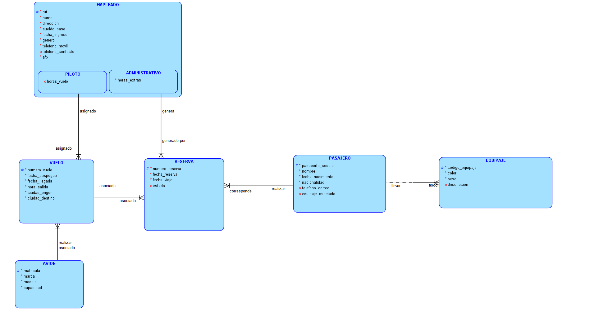
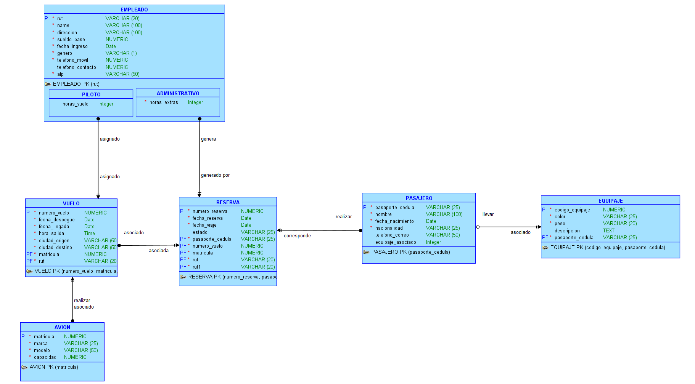

# Sistema de Reservas de Vuelos

> Proyecto de modelamiento de base de datos para la gestión de reservas de vuelos, empleados, pasajeros y equipaje.

## Descripción
El modelo representa un sistema de reservas de vuelos, donde se gestionan:
- **Empleados** (Pilotos y Administrativos)
- **Vuelos** y **Aviones**
- **Reservas**
- **Pasajeros**
- **Equipaje**

Incluye relaciones entre empleados y vuelos, reservas asociadas a pasajeros y vuelos, y la gestión de equipaje vinculado a pasajeros.

## Entidades principales
- **EMPLEADO**: rut, nombre, dirección, sueldo, fecha ingreso, género, teléfonos, afp. Subtipos: Piloto (horas_vuelo), Administrativo (horas_extras).
- **VUELO**: número, fechas y horas, ciudades de origen/destino, matrícula de avión, rut de empleado asignado.
- **AVION**: matrícula, marca, modelo, capacidad.
- **RESERVA**: número, fecha, estado, pasajero, vuelo, empleado que la genera.
- **PASAJERO**: pasaporte/cédula, nombre, nacimiento, nacionalidad, contacto, equipaje asociado.
- **EQUIPAJE**: código, color, peso, descripción, pasaporte/cédula del pasajero.

## Diagrama Entidad-Relación
El modelo ER y el modelo relacional se encuentran en los archivos PNG adjuntos:
### MODEL - BARKER NOTATION

### MODEL - BACHMAN NOTATION

---
**Autores:** Alex Fernández 